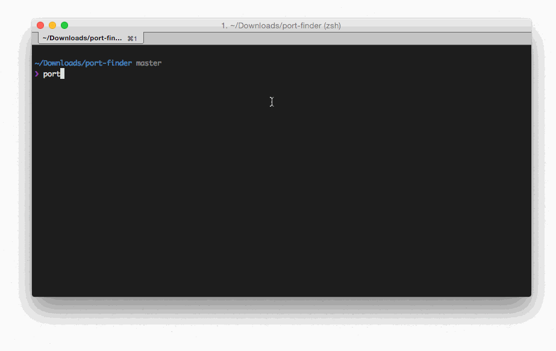

# PortFinder

[](https://travis-ci.org/Kikobeats/port-finder)
[](https://david-dm.org/Kikobeats/port-finder)
[](https://david-dm.org/Kikobeats/port-finder#info=devDependencies)
[](https://www.npmjs.org/package/port-finder)
[](https://www.gittip.com/Kikobeats/)

> Get service name for a port or get a port for a service name. What else? Ah, get available free ports.



## Install

```bash
npm install port-finder -g
```

## License

MIT © [Kiko Beats](http://www.kikobeats.com)


